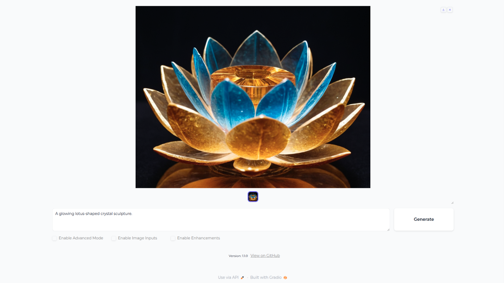

# Fooocus-Prime

Generate amazing images using the power of Fooocus-Prime

**Fooocus-Prime** builds on the original [Fooocus](https://github.com/lllyasviel/Fooocus) image generation tool by adding targeted improvements that make image generation easier and more intuitive.

> ⚠️ **Disclaimer**: This is not an official Fooocus release.

## What's New in Fooocus-Prime

This fork is actively evolving, with features and tweaks added or refined over time. As of now, here’s a snapshot of the current modifications:

- The default image generation count is set to one to simplify the experience 
- Performance settings are organized in a drop-down menu for cleaner navigation
- Output save location, GitHub repository link, and version info are displayed in the interface for quick reference  
- Labels and interface elements are cleaned up for clarity and consistency

## Download and Install
(Coming Soon.)

## Troubleshoot
See the common problems [here.](troubleshoot.md)

## About the Original Fooocus

Fooocus is an image generating software (based on [Gradio](https://www.gradio.app/) ).

Fooocus presents a rethinking of image generator designs. The software is offline, open source, and free, while at the same time, similar to many online image generators like Midjourney, the manual tweaking is not needed, and users only need to focus on the prompts and images.

Read the full [original README](https://github.com/lllyasviel/Fooocus#readme) for more details.

## Disclaimers

- This fork is experimental and provided **“as is”**, without any warranty, express or implied, including but not limited to merchantability or fitness for a particular purpose.  
- Use this software at your own risk. The maintainer is not liable for any damages or data loss resulting from its use.

### Please use **Fooocus-Prime** responsibly and ethically.

You are solely responsible for any content generated using this software. The developer(s) and maintainer(s) of Fooocus-Prime do not endorse, review, or assume liability for any outputs or the way they are used.

AI-generated content should be created and used with care. Always ensure that your use of this software:

- Complies with applicable laws and regulations.
- Respects the rights, privacy, and dignity of individuals.
- Does not cause harm, infringe on intellectual property, or spread misinformation.

By using Fooocus-Prime, you agree to take full responsibility for any content you generate and its consequences. Use this tool mindfully.

## License

This project remains under the [GNU General Public License v3.0](LICENSE), in line with the original Fooocus repository.

## Credits

This fork builds upon [Fooocus](https://github.com/lllyasviel/Fooocus) by [lllyasviel](https://github.com/lllyasviel) and [contributors](https://github.com/lllyasviel/Fooocus/graphs/contributors). Many thanks to the upstream maintainers for their work.
